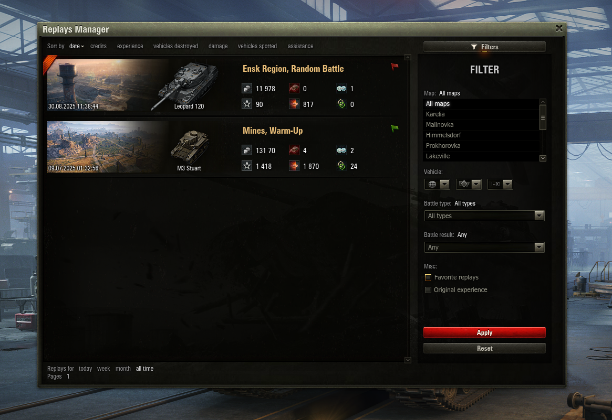

# Replays Manager - World of Tanks Mod

## 🚀 Overview

**Replays Manager** is a powerful mod for **World of Tanks** that simplifies how you handle and analyze your game replays. With this tool, you can easily manage your battle replays, review results, and even upload them directly to the **WoTReplays** website. It’s a must-have for players who want to improve their gameplay and track their performance over time.

## 🌟 Features

- 📊 **Quick Battle Results**: View a summary of your past battles at a glance.
- 🖼️ **In-Game Battle Results Window**: Conveniently access and view saved replays within the in-game battle results window.
- 🌐 **Upload to WoTReplays**: Seamlessly upload your replays to the **WoTReplays** site without leaving the game.
- 🎥 **Replay Playback**: Play back any of your saved replays directly from the game interface.

## 🖼️ Screenshot

### Example of the Replays Manager interface:

## 📦 Dependency
This project relies on the [Mods List](https://gitlab.com/wot-public-mods/mods-list) mod. Make sure to include this mod to ensure the proper functionality of **Replays Manager**.

## 💡 How It Works

After each battle, **Replays Manager** retrieves the shots data and presents a visual representation in your lobby. You can review where shots hit your tank or where your shots hit your enemies, helping you analyze your performance.

## 💖 Donate

If you enjoy **Replays Manager** and would like to support its development, consider making a donation. Your contributions help improve the mod and keep it updated!

- **Support on Patreon**: [Patreon Link](https://www.patreon.com/poliroid)
- **Directly donate**: [Donation Methods](https://poliroid.me/donate/)

Thank you for your support!

## 📄 License

This project is licensed under the MIT License - see the [LICENSE](./LICENSE.md) file for details.

## 🤝 Contributing

Feel free to contribute to the project by submitting issues or pull requests! We welcome all forms of feedback and contributions from the World of Tanks community.

---

Enjoying Replays Manager? Consider supporting us by sharing this mod with other players!